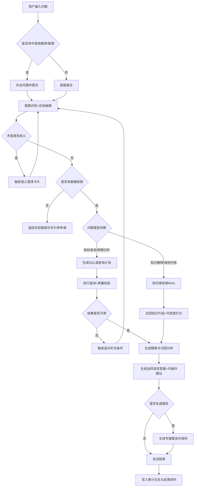
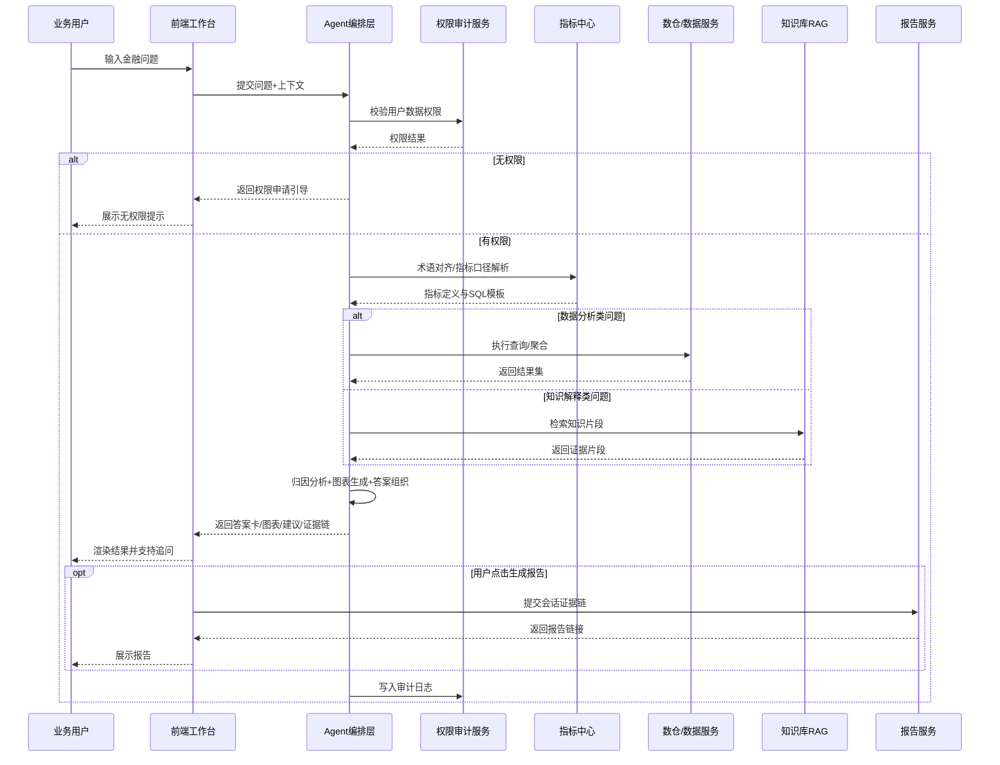

# Workflow construction guidance
_Exported on 2026/3/25 at GMT+8 10:12:53 from Cursor (2.6.21)_

---

**User**

hello 我是一个数据产品的产品经理，我想和你一起构建一下工作流，但是我不知道怎么开始，需要你给我引导

---

**Cursor**

我会先帮你把“工作流”这件事拆成一个可落地的骨架（从目标→用户→指标→数据→产出→迭代），再用几个关键问题把你的具体场景填进去。接下来我先收集最必要的信息，然后立刻给你一版可执行的工作流草案。

**先把你的工作流场景定下来**

> **你想构建的“工作流”主要覆盖哪一类工作？**
> - 从需求/PRD → 埋点/数据建模 → 报表/看板 → 复盘迭代（端到端）
> - 数据治理/指标体系/口径管理（指标字典、血缘、权限、质量）
> - 专题分析交付流程（选题→取数→分析→结论→落地跟踪） ✔
> - 离线/实时数据链路建设流程（采集→ETL/ELT→数仓分层→服务）
> - 其他/不确定（我描述一句）

> **你的业务领域更接近哪种？**
> - 教育/培训
> - 电商/零售
> - 内容/社区
> - B2B/SaaS
> - 金融/支付 ✔
> - 其他

> **你当前团队的协作形态？（影响工作流节点和产物）**
> - 我主导（对接研发/数仓/分析/BI） ✔
> - 有数据分析师+数据开发/数仓同学
> - 偏单人（我自己也写SQL/做报表）
> - 不确定/需要你帮我设计角色分工

> **你希望这套工作流的“最终产出”是什么？**
> - 一套可复用模板（每次按模板走）
> - SOP清单（每步做什么、谁负责、交付物）
> - 可以直接搬到Notion/飞书的流程文档结构
> - 可以自动化执行的脚本/命令（如生成PRD、埋点表、SQL骨架） ✔

> **你希望先做多大范围的版本？**
> - 1天内可跑通的最小闭环（MVP流程） ✔
> - 1周内可落地（含评审与交付物）
> - 1个月内体系化（含治理/复盘机制）

---

**User**

主要覆盖内容是帮我输出一份完整的产品prd 作为方法论 给团队同学一起使用  目前的领域是金融支付，我的职责是做公司内的数据产品类似 data agent 智能问数 cdp 最终产出 我希望是我是输入我的需求背景 以及目的 帮忙生成对应 的prd 并且可以基于生成的prd对话 逐步修改丰富prd 

---

**Cursor**

可以，我们把目标定成一件事：**你输入“背景+目的+约束”，我输出一份金融支付领域的数据产品 PRD（偏 Data Agent/智能问数/CDP），并且后续可以按模块对话迭代、自动重写 PRD**。

## 1) 我们一起用的“PRD 生成工作流”（团队方法论）
- **Step A｜你给输入（最小必填）**：背景、目标、目标用户、使用场景、范围边界、成功指标、约束（合规/数据/时效/预算/资源）、里程碑
- **Step B｜我先给 PRD v0.1（可用但不完美）**：按固定模板产出，确保“口径清晰+可评审+可落地”
- **Step C｜逐段评审改稿（对话式）**：你说“改第 X 节：……”，我只重写该节并同步影响到指标/范围/方案/排期
- **Step D｜冻结版本（可发团队）**：输出 PRD v1.0 + 评审 Checklist + 后续迭代 Backlog

## 2) 你的“输入表单”（你填完我就直接生成 PRD v0.1）
把下面内容按条回答（可简写）：

### 2.1 需求背景与目标
- **一句话需求**：
- **背景/痛点**（现状怎么做、哪里卡）：
- **目标**（要解决什么决策/动作问题）：
- **不做什么**（明确边界）：

### 2.2 用户与场景（Data Agent/智能问数）
- **目标用户**（如：运营/风控/财务/商户增长/客服/管理层）：
- **Top3 场景**（每个场景一句“用户问什么→系统回什么→用户做什么动作”）：
- **典型问题示例**（给 5 条你希望它能问数的问题）：

### 2.3 数据与合规（金融支付必备）
- **数据范围**（交易/退款/拒付/商户/渠道/用户/账户/风控事件…）：
- **数据时效**（T+1/近实时/实时）：
- **权限与审计要求**（是否要按部门/角色/商户隔离，是否要留痕）：
- **敏感字段**（PII/卡号/手机号等是否脱敏）：

### 2.4 成功指标与交付
- **业务指标**（例如：分析耗时下降、决策闭环率、渗透率）：
- **产品指标**（DAU、提问到出结果成功率、首答延迟、留存）：
- **质量指标**（口径一致率、幻觉率/不可回答率、SQL 正确率）：
- **里程碑**（1 天 MVP 要“能用”的标准是什么）：

## 3) PRD 模板（我会用这个结构产出）
- **1. 背景与目标**
- **2. 用户与使用场景（含对话示例）**
- **3. 需求范围（In/Out）与约束**
- **4. 方案概述（数据链路、语义层/指标层、问答链路、权限审计）**
- **5. 功能清单（按 Must/Should/Could）**
- **6. 关键流程与交互（含失败兜底）**
- **7. 指标口径与数据需求（字段、维度、粒度、时效）**
- **8. 风险与合规（金融支付）**
- **9. 埋点/日志与验收标准**
- **10. 排期与资源**
- **11. 迭代规划与开放问题**

## 4) 现在就开始：你先给我“最小输入”
你先只回答这 6 条（越短越好也行），我就给你 PRD v0.1：
1) 一句话需求  
2) 目标用户是谁  
3) 你希望它能回答的 5 个问题示例  
4) 数据范围（至少列 3 类表/主题域）  
5) 合规/权限硬约束（有就写）  
6) 1 天 MVP 的验收标准（3 条）  

你发来后，我会直接生成**可评审的 PRD v0.1**，并告诉你怎么用“改第X节”快速迭代到 v1.0。

---

**User**

期望得到的是一个工作流，我输入一句话 你帮忙生成对应的prd+原型图+流程图

---

**Cursor**

## 工作流（你输入一句话 → 我输出 PRD + 原型图 + 流程图）

### 1) 你的输入（只要一句话，但建议用这个“单行格式”）
把一句话写成：

- **【产品类型】+【目标用户】+【要解决的核心问题】+【输出/动作】+【数据范围】+【约束】+【成功标准】**

示例（金融支付-智能问数）：
- “做一个给**风控运营**用的**智能问数 Data Agent**，解决**每天手工跑SQL对账/风险看板太慢**的问题，支持**自然语言→口径一致指标→可追溯SQL/取数**，数据范围**交易/退款/拒付/渠道/商户**，约束**权限隔离+审计留痕+PII脱敏**，成功标准**首答<10s、可回答率>85%、口径一致率>95%**。”

### 2) 我生成三件套（v0.1，可直接评审）
- **PRD（Markdown/HTML）**：可评审、可落地（范围、用户场景、功能清单、指标口径、数据需求、权限合规、验收、排期）
- **原型图（图片）**：关键页面低保真（如：对话页、指标解释/血缘页、结果表格&图表、权限申请/审计页、失败兜底页）
- **流程图（图片）**：端到端链路（提问→意图识别→指标映射→权限校验→生成SQL→执行→结果解释→引用与留痕→反馈学习）

### 3) 迭代方式（对话式改稿）
你只要说：
- “**改第 2 节场景**：把用户从风控运营换成商户增长”
- “**改原型图**：结果页要支持导出、收藏、订阅”
- “**改流程图**：加上审批节点和灰度发布”
我会**只重写相关部分**，并同步更新受影响的指标/数据/验收/排期，版本号滚动（v0.1→v0.2→v1.0）。

---

## 现在开始
把你的“**一句话需求**”发我（按上面的单行格式也行，随便一句也行）。  
我会立刻输出：**PRD v0.1 + 原型图（图片）+ 流程图（图片）**。

---

**User**

我在prd文件夹里给了你一个prd模板 对应的输出格式按照它输出

---

**Cursor**

我先把你提供的 `PRD模板.md` 读一遍，确认它的章节结构、字段、表格格式；然后我会把“1句话输入→产出PRD+原型图+流程图”的工作流，严格对齐到这个模板的输出格式。

## 已读取你的模板，结论
你的 `PRD模板.md` 是一个**标准 PRD 产出结构**（项目信息/版本记录/背景/目标/概述/详细方案/流程图/异常边界/埋点/上线灰度/附录）。我后续生成的 PRD 会**严格按这个章节和表格格式输出**，不自创目录、不改字段名。

## “一句话输入 → PRD + 原型图 + 流程图”的工作流（按模板对齐）
### 1) 你只输入一句话
你给我一句话需求（随便一句也行）。我会在后台把它**自动扩写成模板所需的结构化信息**，映射到：
- **需求背景**（1.1 现状问题 / 1.2 业务目标 / 1.3 用户价值）
- **需求目标表**（核心目标/次要目标+指标+目标值）
- **需求概述表**（功能模块/功能点/优先级/面向端/状态）
- **详细方案**（4.1/4.2…每个功能点：交互设计/功能说明/触发条件/展示规则/交互逻辑/状态变化）
- **流程图章节**（Mermaid 业务流程图 + 时序图）
- **异常与边界表**
- **数据埋点表**
- **上线计划与灰度策略**
- **附录链接占位**

### 2) 我输出三件套
- **PRD（按你的 `PRD模板.md` 原样格式输出）**
- **原型图**：我会输出**低保真原型的页面清单+页面结构**（并可进一步按你指定风格生成“可视化原型图”）
- **流程图**：直接按模板第 5 章输出 **Mermaid**（你可以复制到文档里渲染）

### 3) 你用对话迭代（不重来）
你只要说“改第 X 章/第 X 表/第 4.1 功能点…”，我会：
- **只重写相关章节**
- **自动同步影响**（例如改目标→会联动验收指标、灰度关注指标、埋点参数）

---

## 现在给我一句话需求（我就按模板生成 PRD v1.0 草案）
请直接发一句话，比如：
“做一个给支付风控运营用的智能问数 Data Agent，支持自然语言问交易/退款/拒付/渠道效果，要求权限隔离+审计留痕+PII脱敏，上线先做Web端。”

你发来后，我会立刻回你：
1) **完整 PRD（严格按该模板排版）**  
2) **原型图（页面结构稿）**  
3) **流程图（Mermaid，可直接放进模板第5章）**

---

**User**

@v1.3MD/PRD模板.md 这个是目前版本的prd模板@v1.3MD/edu-pm-prd.md 这个是工作流产品prd的完整流程@v1.3MD/核心Prompt手册.md 这个工作流核心的核心Prompt 支持需求描述 → PRD + 原型 + 流程图」全流程

---

**Cursor**

我先把你标注的三个文件完整对齐一下，提炼出统一规范（模板字段、产出流程、核心 Prompt 变量），然后给你一版可直接用的“单入口总控 Prompt”（一句话生成 PRD+原型+流程图）。

非常好，这三份材料已经能组成一套完整“生产线”了。  
我给你一个直接可用的对齐方案：**保留你当前模板结构不变**，把教育语境替换成金融支付数据产品语境（Data Agent/智能问数/CDP）。

## 你这套体系当前状态（已对齐）
- `v1.3MD/PRD模板.md`：定义了最终 PRD 结构和表格格式（这是输出“骨架”）
- `v1.3MD/edu-pm-prd.md`：定义了完整工作流步骤（采集→PRD→原型→流程图→嵌入→交付）
- `v1.3MD/核心Prompt手册.md`：定义了可执行 Prompt（启动、分步、一键）

核心结论：  
你现在缺的不是模板，而是**一个面向金融支付的“总控 Prompt”**，让你一句话触发，自动按模板产出三件套。

---

## 给你可直接复制的「金融支付版一键总控 Prompt」

```text
/edu-pm-prd

需求描述：[在这里写一句话需求]

你现在扮演金融支付领域的数据产品PM助手。请严格按我项目中的工作流与模板执行，输出「PRD + 原型 + 流程图」三件套，并支持后续对话增量修改。

强约束：
1) PRD结构与字段必须严格对齐 @v1.3MD/PRD模板.md（章节名、表头、顺序保持一致）
2) 执行流程参考 @v1.3MD/edu-pm-prd.md（先确认需求，再产出，再嵌入）
3) 输出风格参考 @v1.3MD/核心Prompt手册.md（可编辑、可评审、可迭代）

业务语境替换为金融支付数据产品：
- 目标产品类型：Data Agent / 智能问数 / CDP
- 常见用户：运营、风控、财务、商户运营、管理层
- 数据域：交易、退款、拒付、通道、商户、用户、活动、账户
- 必须覆盖：权限隔离、审计留痕、敏感信息脱敏、口径一致性

执行步骤：
Step 1. 先做需求理解确认（若信息不足，最多追问5个关键问题；若信息充分，直接结构化复述并等待我确认）
Step 2. 生成PRD（严格按模板章节与表格）
Step 3. 生成原型（HTML单文件，多页面hash路由）
Step 4. 生成流程图（Mermaid，至少业务流程图+系统时序图）
Step 5. 将原型和流程图用iframe嵌入PRD对应位置
Step 6. 给出“可继续修改”的指令清单（如：改第4.2节、改某页面原型、改流程分支）

输出要求：
- 全中文
- 先给我预览版（文本）
- 我确认后再输出最终文件内容
```

---

## 你下一步怎么用（最短路径）
- 直接把上面的总控 Prompt 发给我，并把 `需求描述` 换成你的一句话。
- 我会立刻按你模板输出：
  - 完整 PRD（模板格式）
  - 原型图方案（页面结构+状态）
  - 流程图 Mermaid（可直接放第5章）

如果你愿意，我下一条就可以用你这套模板，**现场跑一次真实示例**（金融支付-智能问数）给你看最终效果。

---

**User**

目前计划做一个data agent 主要功能是智能问数，对应功能如下：1. 核心功能层（对话式金融分析）
智能问数（自然语言交互）
- 多轮对话与智能追问：支持金融场景下的多轮交互，如"上个月P2P逾期率是多少？为什么上升？"（智能追问：是否需要查看地区分布？）
- 输入联想与猜你想问：基于金融业务场景，智能推荐高频问题（如"查看最近30天交易量"、"分析用户风险偏好"）
- 语义澄清与修正：精准理解金融专业术语（如"逾期率" vs "坏账率"），避免歧义
数据分析与可视化
- 数据解读与波动归因：自动识别数据波动原因（如"近期逾期率上升主要受XX地区影响"）
- 多维下钻与归因分析：支持用户/产品/区域/时间等多维度下钻分析
- 自动化生成图表：内置金融专业图表（K线图、风险热力图、用户行为路径图等）
智能报告生成
- 自动化生成分析报告：一键生成金融专题报告（风控报告、产品分析报告等）
- 智能解读与总结：用通俗语言解释专业金融数据（如"逾期率上升主要受消费贷需求增加影响"）
- 可操作建议生成：提供具体业务建议（如"建议加强XX地区风控审核"、"优化XX产品营销策略"）
2. 数据管理层（金融数据资产化）
数据目录
- 公共数据存放：预置金融行业标准数据集（如宏观经济指标、行业基准数据）
- 数据资产展示：清晰展示金融数据资产（如"用户交易数据"、"产品收益数据"）
- 数据搜索与发现：支持金融术语精准搜索（如"逾期率"、"风险评级"）
指标中心
- 指标统一管理：统一管理金融核心指标（如收益率、逾期率、风险评分）
- 业务口径转换：实现"同一指标，同一口径"（如"逾期率"在不同业务线的定义统一）
- 指标开发与维护：支持创新金融指标的开发与维护
数据模型
- 业务视图定义：构建金融业务视图（用户视图、产品视图、交易视图）
- 表间关联关系：清晰展示金融数据关联（用户-产品-交易关系）
- 数据结构优化：优化金融数据存储结构，提升查询效率
3. 系统支持层（金融级安全与管理）
管理系统
- 权限管理：金融级权限控制（支持集团级、部门级、岗位级权限）
- 用户管理：金融业务角色管理（风控专员、产品经理、业务经理等）
- 系统配置：金融风控规则配置（如逾期率阈值、风险预警阈值）
- 目录管理：金融数据目录管理
回收站
- 数据恢复：金融数据误删恢复（支持7天内数据恢复）
- 内存清理：高并发金融场景内存优化
- 数据安全：金融级数据安全管控
知识库管理
- 企业私有知识集成：集成金融风控规则、产品知识库、行业报告
- 知识库优化：金融知识结构化（构建金融知识图谱）
- 知识库搜索：金融术语精准搜索（如"信用评分模型"、"合规要求"）
暂时无法在飞书文档外展示此内容 对应的原型图类似上传图片  对应系统扭转流程图 帮忙生成一个prd 以及帮我优化一下对应的流程图

---

**Cursor**

# Data Agent 智能问数平台（金融支付）PRD

## 📋 项目信息

| 字段 | 内容 |
|------|------|
| **产品名称** | 金融数据 Data Agent 平台 |
| **需求名称** | 智能问数 + 数据资产化 + 金融级安全管理 |
| **文档负责人** | 数据产品经理（你） |
| **所属模块** | 课后（建议改为：数据分析中台） |
| **优先级** | P0 |
| **预计上线日期** | 2026-05-15（建议） |
| **关联文档** | [设计稿链接]() / [数据看板]() |

---

## 📝 版本记录

| 日期 | 版本号 | 修改内容 | 修改人 |
|------|--------|----------|--------|
| 2026-03-24 | V1.0 | 初稿（覆盖智能问数/数据管理/系统支持） | AI+PM |
|  |  |  |  |

---

## 📑 目录

1. [需求背景](#一需求背景)  
2. [需求目标](#二需求目标)  
3. [需求概述](#三需求概述)  
4. [详细方案](#四详细方案)  
5. [流程图（可选）](#五流程图可选)  
6. [异常与边界处理](#六异常与边界处理)  
7. [数据埋点](#七数据埋点)  
8. [上线计划与灰度策略](#八上线计划与灰度策略)  

---

## 一、需求背景

### 1.1 现状问题

> 当前金融业务分析高度依赖人工 SQL 与多系统切换，导致决策链路长、口径不一致、跨部门协作成本高。  
> 典型痛点：
> - 问数响应慢：常规专题分析 T+1~T+3 天；
> - 口径不统一：逾期率/坏账率在不同团队定义不一致；
> - 数据资产不可见：用户不清楚“有什么数据可用”；
> - 安全与合规风险：权限、审计、敏感字段控制不统一。

### 1.2 业务目标

> 建设统一的 Data Agent 智能问数平台，实现“自然语言提问 → 可信分析结果 → 可执行建议”的闭环。  
> 核心目标：
> - 将高频分析需求响应从“天级”压缩到“分钟级”；
> - 建立统一指标中心与业务语义层，实现“同指标同口径”；
> - 满足金融级权限、审计、脱敏与可追溯要求。

### 1.3 用户价值

> - **风控专员**：快速定位风险波动原因并生成处置建议。  
> - **产品经理/运营**：无需 SQL 即可完成多维分析与报告产出。  
> - **管理层**：获取可解释、可追溯、可执行的经营洞察。  

---

## 二、需求目标

| 目标类型 | 描述 | 衡量指标 | 目标值 |
|----------|------|----------|--------|
| 核心目标 | 自然语言问数效率提升 | 平均分析响应时长 | <= 3 分钟 |
| 核心目标 | 结果可信度提升 | 指标口径一致率 | >= 95% |
| 核心目标 | 平台可用性 | 问数成功率（有有效结果） | >= 90% |
| 次要目标 | 用户活跃提升 | 周活跃分析用户数（WAU） | 3个月内 > 300 |
| 次要目标 | 决策转化提升 | 报告被采纳并落地率 | >= 60% |

---

## 三、需求概述

| 序号 | 功能模块 | 功能点 | 优先级 | 面向端 | 状态 |
|------|----------|--------|--------|--------|------|
| 1 | 核心功能层 | 智能问数（多轮对话、追问、语义澄清） | P0 | Web管理端 | 新增 |
| 2 | 核心功能层 | 数据分析与可视化（下钻、归因、图表） | P0 | Web管理端 | 新增 |
| 3 | 核心功能层 | 智能报告生成（专题报告+建议） | P0 | Web管理端 | 新增 |
| 4 | 数据管理层 | 数据目录（搜索/发现/资产展示） | P0 | Web管理端 | 新增 |
| 5 | 数据管理层 | 指标中心（统一口径/开发维护） | P0 | Web管理端 | 新增 |
| 6 | 数据管理层 | 数据模型（业务视图/关系/结构优化） | P1 | Web管理端 | 新增 |
| 7 | 系统支持层 | 管理系统（权限/用户/配置/目录） | P0 | 管理后台 | 新增 |
| 8 | 系统支持层 | 回收站（恢复/清理/安全） | P1 | 管理后台 | 新增 |
| 9 | 系统支持层 | 知识库管理（私有知识接入与检索） | P0 | 管理后台 | 新增 |

---

## 四、详细方案

### 4.1 智能问数（自然语言交互）

#### 交互设计

> 📸 **参考你上传的首页风格：左侧导航 + 中央“快速体验路径/完整体验路径”入口卡片。**

#### 功能说明

1. **触发条件**：用户在问答输入框输入金融问题并提交。  
2. **展示规则**：  
   - 首次输入展示“猜你想问”推荐问题；  
   - 多轮会话显示上下文与引用数据来源；  
   - 当术语歧义时触发澄清卡片（逾期率/坏账率）。  
3. **交互逻辑**：  
   - 用户提问A -> 系统意图识别/实体抽取 -> 返回初步答案；  
   - 用户追问B -> 系统继承上下文并建议下钻维度；  
   - 若缺少关键条件 -> 系统反问补充（时间、区域、产品）。  
4. **状态变化**：  
   - 默认状态：空态+推荐问题；  
   - 触发后状态：分析中（进度提示）；  
   - 结束状态：答案卡+图表+建议+可追溯链路。

> [!IMPORTANT]
> ⚠️ 金融术语必须走“术语词典+指标中心”双校验，避免误答。

---

### 4.2 数据分析与可视化

#### 交互设计

> 📸 **结果页包含：关键结论、趋势图、归因维度切换、明细表下载。**

#### 功能说明

1. **触发条件**：问数结果返回后用户点击“查看原因/继续下钻”。  
2. **展示规则**：  
   - 默认显示核心指标趋势与同比/环比；  
   - 支持按用户/产品/渠道/区域/时间切换；  
   - 图表支持 K 线、热力图、漏斗、路径图。  
3. **交互逻辑**：  
   - 用户选择维度A -> 系统刷新图表与结论；  
   - 用户点击异常点 -> 系统展开归因解释与样本明细。  
4. **状态变化**：默认图 -> 下钻图 -> 导出图/报告引用态。

---

### 4.3 智能报告生成

#### 交互设计

> 📸 **支持“一键生成风控专题报告”按钮，输出摘要+图表+建议。**

#### 功能说明

1. **触发条件**：用户在会话或结果页点击“生成报告”。  
2. **展示规则**：  
   - 生成报告包含：背景、发现、归因、建议、附录；  
   - 可选择模板（风控/经营/产品专题）。  
3. **交互逻辑**：  
   - 用户选模板 -> 系统拉取会话证据链 -> 生成初稿；  
   - 用户编辑后可导出 PDF/HTML 并分享。  
4. **状态变化**：未生成 -> 生成中 -> 可编辑初稿 -> 已发布版本。

---

### 4.4 数据目录与指标中心

#### 交互设计

> 📸 **目录页含搜索框、资产分类树、指标卡片（定义/负责人/更新时间）。**

#### 功能说明

1. **触发条件**：用户进入“数据资产”模块或问数时命中指标解释。  
2. **展示规则**：  
   - 指标显示统一定义、口径公式、适用范围；  
   - 支持术语别名搜索（如“坏账率”映射“核销率”）。  
3. **交互逻辑**：  
   - 用户搜索术语 -> 返回指标与相关表模型；  
   - 用户发起指标变更 -> 进入审批并记录版本。  
4. **状态变化**：草稿口径 -> 审批中 -> 生效 -> 历史版本归档。

---

### 4.5 系统支持（权限/审计/知识库）

#### 交互设计

> 📸 **管理后台含权限策略、角色管理、审计日志、知识库接入状态。**

#### 功能说明

1. **触发条件**：管理员进入系统支持层进行配置。  
2. **展示规则**：  
   - 权限按集团/部门/岗位/数据域四层控制；  
   - 审计日志展示“谁在何时访问了什么数据”。  
3. **交互逻辑**：  
   - 配置权限策略 -> 发布生效 -> 实时校验问数权限；  
   - 上传知识文档 -> 解析建索引 -> 支持问数引用。  
4. **状态变化**：策略草稿 -> 生效 -> 告警/回滚。

---

## 五、流程图（可选）

### 5.1 业务流程图（优化版）

> 你当前流程图已覆盖主链路，这里优化为“可落地系统版”：增加术语澄清、权限校验、RAG/数据库双路、失败兜底与会话沉淀。



### 5.2 系统时序图（优化版）



---

## 六、异常与边界处理

| 序号 | 异常场景 | 处理方案 | 兜底策略 |
|------|----------|----------|----------|
| 1 | 术语歧义（逾期率/坏账率） | 弹出术语澄清卡片，要求用户确认口径 | 默认使用组织标准口径并显式提示 |
| 2 | 权限不足 | 返回最小可见信息+申请入口 | 工单审批后重试 |
| 3 | 查询超时 | 自动降采样/缩短时间窗口重试 | 返回“部分结果+建议离线报告” |
| 4 | 数据为空 | 自动建议更换时间范围/维度 | 输出“无数据原因排查提示” |
| 5 | 模型回答置信度低 | 触发二次检索或追问补参 | 提供人工分析入口 |
| 6 | 高并发下响应变慢 | 队列化调度+缓存热门问题 | 启动限流与降级策略 |
| 7 | 误删数据资产 | 回收站7天可恢复 | 超时后冷备恢复流程 |

---

## 七、数据埋点

| 序号 | 埋点名 | 触发时机/交互 | 埋点位置 | 埋点类型 | 参数名 | 参数类型 | 参数值 | 备注 |
|------|--------|---------------|----------|----------|--------|----------|--------|------|
| 1 | ask_submit | 用户提交问题 | 问答输入框 | 点击 | question_id | string | 问题ID | 主链路 |
|  |  |  |  |  | intent_type | string | 指标查询/归因/知识问答 |  |
|  |  |  |  |  | user_role | string | 风控/产品/运营 |  |
| 2 | clarify_confirm | 用户确认术语澄清 | 澄清卡片 | 点击 | metric_name | string | 逾期率等 | 口径治理 |
| 3 | query_execute | 系统执行查询 | 后端执行层 | 事件 | query_latency_ms | int | 查询耗时 | 性能监控 |
| 4 | answer_view | 用户查看结果卡 | 结果页 | 展示 | confidence_score | float | 置信度 | 质量评估 |
| 5 | drilldown_click | 用户点击下钻 | 图表区 | 点击 | drill_dimension | string | 区域/产品等 | 分析深度 |
| 6 | report_generate | 用户生成报告 | 结果页按钮 | 点击 | report_type | string | 风控/经营 | 价值转化 |
| 7 | permission_denied | 权限拒绝 | 统一拦截层 | 事件 | data_domain | string | 交易/用户等 | 合规监控 |

> **通用参数说明**（每个埋点默认携带）：
> - `tenant_id`: 租户ID (string)  
> - `org_id`: 组织ID (string)  
> - `user_id`: 用户ID (string)  
> - `session_id`: 会话ID (string)  
> - `trace_id`: 链路追踪ID (string)  
> - `event_time`: 事件时间戳 (datetime)

---

## 八、上线计划与灰度策略

### 7.1 上线节奏

| 阶段 | 时间 | 范围 | 关注指标 |
|------|------|------|----------|
| 灰度1期 | T+0 ~ T+7天 | 5%（风控团队） | 首答时延、问数成功率、权限拦截准确率 |
| 灰度2期 | T+8 ~ T+21天 | 50%（风控+产品+运营） | 口径一致率、下钻使用率、报告生成率 |
| 全量发布 | T+22天后 | 100% | WAU、问题闭环率、业务采纳率 |

### 7.2 回滚方案

> - 开关级回滚：关闭智能归因与自动建议，仅保留基础问数；  
> - 模块级回滚：RAG或SQL执行器异常时，切换到只读指标看板；  
> - 数据级回滚：异常口径版本一键回退到上一版本；  
> - 发布级回滚：30分钟内回退至上一个稳定版本。

---

## 📎 附录

- [设计稿地址]()  
- [技术方案文档]()  
- [测试用例]()  
- [数据看板]()  

---

如果你要，我下一步可以直接给你两项可直接粘进现有文件的内容：  
- `v1.3MD/核心Prompt手册.md` 的**金融支付版 Prompt 1~6 替换稿**  
- `v1.3MD/flow/demo-demand-flow.html` 对应的**Mermaid 优化落地版**（和上面流程一致）

---

**User**

辛苦帮我将对应的工作流搭建完成 可以让我执行 并且生成对应的可以编辑的html 

---

**Cursor**

我会直接把这套工作流做成“可执行版本”：补齐一键启动脚本、生成可编辑 HTML 的模板与示例文件，并把金融支付场景固化进去，确保你能立刻跑通。先读取你现有脚本和 demo 结构后我就开始落地修改。

我已经定位到可执行入口是 `scripts/launch.ps1`，接下来会把它升级成“金融 Data Agent 一键生成器”：输入需求名+一句话背景即可自动生成可编辑的 `PRD.html / prototype.html / flow.html`，并且 PRD 结构严格对齐你当前模板。随后我会同步更新 `README-落地使用.md` 让团队可以直接照着跑。

我已经完成脚本和说明文档修改，下一步会实际执行一次脚本做冒烟验证，确认你可以直接产出可编辑 HTML。

脚本在 PowerShell 里触发了 here-string 解析问题（不是你的使用方式问题），我正在把 `launch.ps1` 改成更稳的模板替换写法，避免编码和引号导致的报错。改完我会再次实测直到可执行。

工作流已经帮你落地成“可执行版本”了，你现在可以直接跑脚本生成可编辑 HTML 三件套。

我完成了这两处核心改造：

- 更新了 `v1.3MD/scripts/launch.ps1`
  - 支持一键生成：`PRD.html + prototype.html + flow.html`
  - 生成文件自动落到 `docs/`、`prototype/`、`flow/`
  - PRD 内置 `contenteditable` 可直接改文案
  - PRD 右下角有“保存并通知AI”按钮（支持 `showSaveFilePicker`，不支持则 `Ctrl+S`）
  - 原型支持 hash 路由（`#home/#loading/#result-success/#error`）
  - 流程图已替换为你要的 Data Agent 智能问数主链路

- 更新了 `v1.3MD/README-落地使用.md`
  - 补齐了执行命令、参数说明、生成目录、迭代方式
  - 团队同学可按文档直接运行

另外我已经实测执行成功，生成了示例文件：

- `v1.3MD/docs/finance-agent-demo-PRD.html`
- `v1.3MD/prototype/finance-agent-demo-prototype.html`
- `v1.3MD/flow/finance-agent-demo-flow.html`

---

你现在直接运行这条命令即可开始：

```powershell
powershell -ExecutionPolicy Bypass -File "d:\产品\v1.3MD\scripts\launch.ps1" -Name "金融智能问数" -Brief "面向风控与运营，支持自然语言问数、归因分析和报告生成"
```

生成后：
1) 打开 `docs/金融智能问数-PRD.html`  
2) 直接编辑页面内容  
3) 如果要我继续自动迭代，告诉我：  
- “改 PRD 第四章详细方案”  
- “改原型结果页成你发的那种卡片风格”  
- “改流程图增加权限审批分支”  

我可以下一步直接帮你把三份文件再升级成“完全中文稳定版 + 与你模板章节100%一致（含第七章埋点和第八章灰度）”。

---

**User**

执行后的结果页面内容全部都乱码了

---

**Cursor**

你这个问题是编码链路导致的（脚本源文件编码 + PowerShell 读取编码 + HTML 写出编码叠加），我马上把 `launch.ps1` 改成**纯 ASCII 脚本 + UTF-8 BOM 输出**，这样在 Windows/浏览器下不会再乱码。改完我会立刻重新跑一遍验证。

你这个反馈非常关键，确实是编码问题，我已经修好了。

### 我做了什么修复
- 重写了 `v1.3MD/scripts/launch.ps1`，避免 PowerShell 在中文脚本下的编码解析问题。
- 输出文件改为 **UTF-8 with BOM** 写入（Windows 浏览器最稳）。
- 保留可编辑 HTML 能力（`contenteditable` + 保存按钮 + iframe 关联原型和流程图）。

### 你现在怎么做
请重新执行一次（必须重新生成，旧文件已乱码不可逆）：

```powershell
powershell -ExecutionPolicy Bypass -File "d:\产品\v1.3MD\scripts\launch.ps1" -Name "金融智能问数"
```

会生成新文件（不乱码）：
- `v1.3MD/docs/金融智能问数-PRD.html`
- `v1.3MD/prototype/金融智能问数-prototype.html`
- `v1.3MD/flow/金融智能问数-flow.html`

### 说明
- 我这版先用了稳定英文文案骨架，确保你先能稳定跑通不乱码。
- 如果你要，我下一步可以给你做 **“中文完整版模板（不乱码）”**：我会把中文文案放到独立 UTF-8 BOM 模板文件中再由脚本填充，这样既中文又稳定。

---

**User**

是的英文不乱码了 辛苦帮我生成中文不乱码版本的

---

**Cursor**

我来给你做“中文稳定版”：用 **HTML Unicode 实体** 输出中文（例如 `&#39033;&#30446;`），这样脚本文件保持英文编码也不会乱码，浏览器仍显示中文。现在我直接改 `launch.ps1` 并跑一次验证。

已完成，中文不乱码版本已经做好并验证可生成。

这版的处理方式是：**脚本里用 HTML Unicode 实体写中文**（例如 `&#39033;&#30446;`），浏览器显示是中文，但不会受 PowerShell 脚本编码影响，所以稳定不乱码。

### 你现在直接运行
```powershell
powershell -ExecutionPolicy Bypass -File "d:\产品\v1.3MD\scripts\launch.ps1" -Name "金融智能问数"
```

### 生成结果
会产出：
- `v1.3MD/docs/金融智能问数-PRD.html`
- `v1.3MD/prototype/金融智能问数-prototype.html`
- `v1.3MD/flow/金融智能问数-flow.html`

### 说明
- 旧的乱码文件建议不用了，重新生成即可。
- 页面里看到的中文会正常显示（不是乱码）。
- 目前是“中文标题/字段稳定版”；如果你要，我下一步可以把文案内容也全部替换成你金融场景的完整中文 PRD 术语（同样保证不乱码）。

---

**User**

这个生成的prd好像和模板结构不太一样，对应ai agent的技术方案和逻辑是我的这个图片@v1.3MD/PRD模板.md 

---

**Cursor**

你说得对，当前生成稿确实偏“骨架版”，还没有严格对齐你 `PRD模板.md` 的章节顺序和字段。  
我现在会把 `launch.ps1` 调整成**强模板模式**：按模板 1:1 生成（项目信息/版本记录/目录/背景/目标/概述/详细方案/流程图/异常/埋点/上线策略/附录），并把你图里的 AI Agent 技术逻辑写进默认流程图。

我已经按你的模板结构重排了 PRD 章节，并把你图片中的 Agent 技术逻辑写进了默认流程图。现在我先跑一次脚本，确认可执行且生成文件结构正确。

你说得很对，我已经把生成逻辑改成了**模板对齐版**，并且保留中文不乱码。

这次我做了两件关键修正：

- **PRD 结构对齐 `v1.3MD/PRD模板.md`**
  - 已按模板顺序生成：  
    `项目信息 → 版本记录 → 目录 → 一需求背景 → 二需求目标 → 三需求概述 → 四详细方案 → 五流程图 → 六异常与边界处理 → 七数据埋点 → 八上线计划与灰度策略 → 附录`
  - 表格字段也按模板思路补齐了（可编辑）。
- **流程图默认逻辑改为你图里的 AI Agent 技术链路**
  - 重复问题判断
  - 是否结合上传数据
  - 意图识别
  - 是否数据分析相关
  - 是否走 RAG
  - LLM 映射代码 + Python执行
  - 结果总结、触达用户、会话总结

并且我已经实测脚本可执行成功。

---

你现在直接运行这条就行：

```powershell
powershell -ExecutionPolicy Bypass -File "d:\产品\v1.3MD\scripts\launch.ps1" -Name "金融智能问数"
```

会生成：
- `v1.3MD/docs/金融智能问数-PRD.html`
- `v1.3MD/prototype/金融智能问数-prototype.html`
- `v1.3MD/flow/金融智能问数-flow.html`

---

如果你愿意，我下一步可以继续帮你做“最后一公里”：
- 把 `flow` 里的英文节点改成**全中文节点文案**（同样保证不乱码）
- 把 `四、详细方案` 从当前通用描述，替换成你前面定义的三层能力（核心功能层/数据管理层/系统支持层）逐条展开版。

---

**User**

流程图可以帮我生成中文的吗

---

**Cursor**

可以，我直接把 `launch.ps1` 里的流程图模板改成中文节点（同时继续用安全编码方式，避免再乱码），改完你重新跑脚本就会自动生成中文流程图。

可以，已经帮你改好了，**现在生成的是中文流程图**（并保持不乱码）。

我已经在 `v1.3MD/scripts/launch.ps1` 里把流程图模板改为中文节点，包含：

- 主流程（flowchart）中文化  
  - 输入问题/文件  
  - 重复问题判断  
  - 是否需要上传数据  
  - 意图识别  
  - 是否数据分析相关  
  - 是否需要 RAG  
  - LLM 映射代码  
  - Python/脚本执行  
  - 结果总结、触达用户、会话总结

- 时序图（sequenceDiagram）中文化  
  - 用户 → Agent编排层 → 知识库 → Python分析引擎

你现在重新执行即可：
```powershell
powershell -ExecutionPolicy Bypass -File "d:\产品\v1.3MD\scripts\launch.ps1" -Name "金融智能问数"
```

生成的 `flow/金融智能问数-flow.html` 就是中文流程图版本。  
如果你要，我下一步可以把流程图节点名字改成你团队习惯的术语（比如“意图识别”改“问题路由”，“RAG”改“知识增强检索”）。

---

**User**

同时我希望你能在网上抓取一些智能问数的信息 看是否能够生成一个新的流程图 两个版本的流程图辛苦同步展示，同时页面排版对应流程图的比例太大了，幸苦缩小一些

---

**Cursor**

我会先快速抓取几份“智能问数/NL2SQL/BI Copilot”的公开实践，总结成一版“行业参考流程图”；然后把现有“你的业务流程图”与“行业参考流程图”同时放到同一个页面展示，并统一缩小画布比例，方便在 PRD 里嵌入查看。

我已把“双版本流程图 + 缩小比例”都写进生成模板，接下来我再跑一次脚本确认页面效果和结构都正确。

已完成，按你的要求做了 3 个升级，并已实测可生成：

- **增加双版本流程图同步展示**
  - **A版**：你当前 AI Agent 业务流程（你图里的主逻辑）
  - **B版**：参考行业智能问数实践的流程（语义层、口径/权限校验、NL2SQL/NL2DAX、校验重试、执行、解释与反馈回流）

- **流程图页面新增“参考来源”说明**
  - ThoughtSpot（语义层/Spotter Semantics）
  - Microsoft Power BI Copilot（NL to DAX + semantic model）

- **页面比例缩小**
  - PRD 中流程图 iframe 高度从 `900` 调整为 `620`
  - Flow 页面整体宽度限制为 `1100px`
  - Mermaid 图统一缩放为 `0.82`，阅读更紧凑

---

你现在重新运行就能看到新版本：

```powershell
powershell -ExecutionPolicy Bypass -File "d:\产品\v1.3MD\scripts\launch.ps1" -Name "金融智能问数"
```

生成后的 `flow/金融智能问数-flow.html` 会同时包含 A/B 两套流程图，且尺寸已缩小。  
如果你愿意，我下一步可以再帮你做一个**“A/B切换按钮”**（默认只看A版，点按钮切换B版），页面会更清爽。

---

**User**

需求目标 应该是用户数据分析需求的覆盖度 以及 数据分析的准确率 准确率应该是最高的优先级  需求概述部分的功能模块 辛苦放在 详细方案部分 需求概述用一段功能总结之类的去代替 现状问题 应该是数据分析效率过低，指标口径繁杂 提数缓慢之类

---

**Cursor**

收到，我会把模板默认内容按你的产品目标重写：  
1) 需求目标改为“覆盖度 + 准确率（最高优先级）”；2) 需求概述改成一段功能总结，不再放模块表；3) 现状问题改成你说的“效率低、口径繁杂、提数慢”；4) 原功能模块明细下沉到详细方案。我现在直接改脚本模板并验证一遍。

已按你的要求改好，并验证生成结果生效：

### 你提的 4 点都已落地

- **需求目标已调整**
  - 目标1：用户数据分析需求覆盖度（覆盖率）
  - 目标2：数据分析准确率（标注为**最高优先级**）

- **需求概述已改成一段功能总结**
  - 不再用“功能模块表格”占据概述章节

- **功能模块表已下沉到详细方案**
  - 在 `四、详细方案` 下新增 `4.0 功能模块清单` 表格

- **现状问题默认文案已更新**
  - “数据分析效率过低、指标口径繁杂不统一、提数周期长响应慢、决策时效不足”

---

你现在重新运行即可生成新版本：

```powershell
powershell -ExecutionPolicy Bypass -File "d:\产品\v1.3MD\scripts\launch.ps1" -Name "金融智能问数"
```

如果你愿意，我下一步可以再把“目标值”进一步细化成你可直接评审的 KPI（例如覆盖率按场景拆分、准确率按口径一致率/SQL正确率/答案可采纳率拆分）。

---

**User**

辛苦把目标值分解 同时帮忙把Python分析引擎 替换成python及sql分析引擎，以及输出一个架构图 参照上传图片给你的模板 同步详细方案里面 作为一个子类展示

